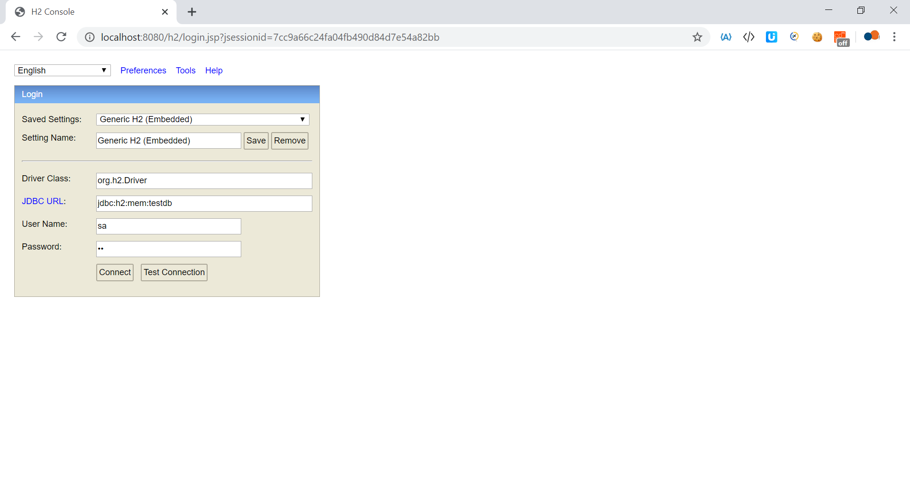
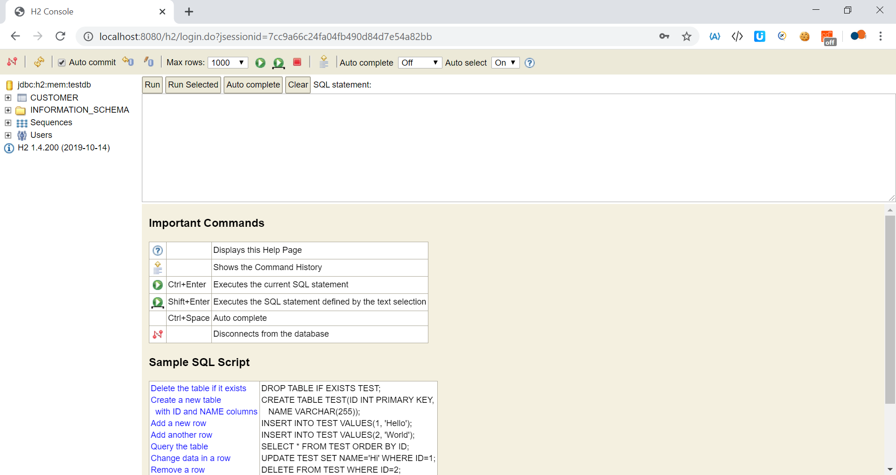
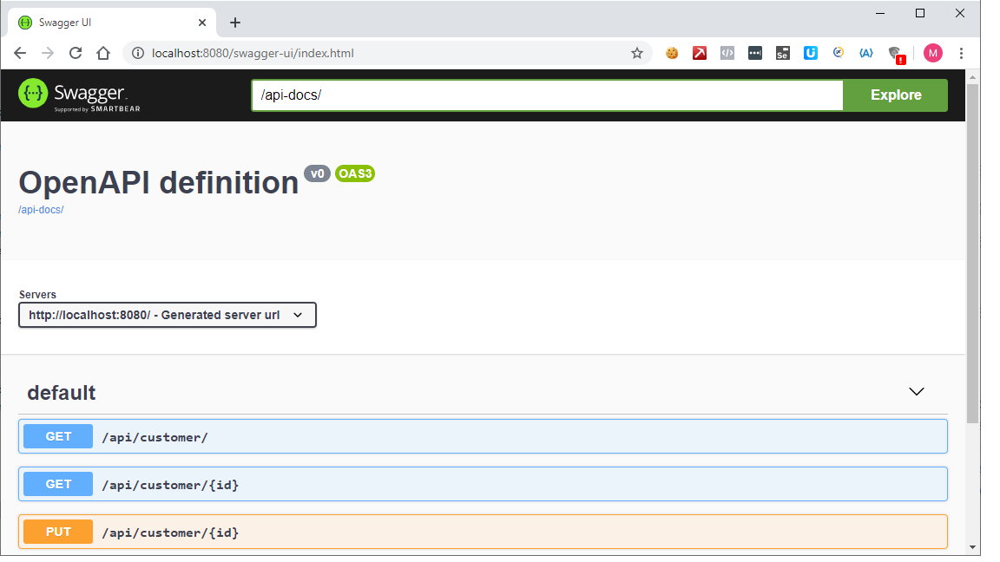

## P.O.C - A.P.I Rest  con meno codice possibile

ho creato questo esempio per testare le potenzialità di 
Spring Boot nel creare  della API rest 
con il minor codice possibile

Per ora c'è solo una get in lettura, ma si possono aggiungere velocemente 
gli altri verbi crudi

L'esempio non pretende di fornire delle A.P.I. 
esaustive ma di capire come iniziare 
un micro servizio in cui nella fase
iniziale le entità variano facilmente

Esempio creato in 1h crica

ho usato le potenzialità di hubernate nella autogenerazione del
DDL su RDBMS 
'spring.jpa.hibernate.ddl-auto=create'

l'esempio comprende un accesso ad oracle ed un accesso a H2

##### Utilizzo

> startup
 
gradlew bootRun

 

> h2 db check

`http://localhost:8080/h2/`

 

> apidocs swagger

`http://localhost:8080/api-docs/`

 

> swagger ui

`http://localhost:8080/swagger-ui/index.html`
`con exploer /api-docs/`
oppure  
`http://localhost:8080//swagger-ui-custom.html`  
personalizzata su `application.properties`

  

##### Riferimenti
Ho preso spunto da:
https://www.baeldung.com/spring-boot-devtools
https://www.baeldung.com/spring-boot-h2-database
https://www.baeldung.com/spring-rest-openapi-documentation
https://www.baeldung.com/spring-boot-data-sql-and-schema-sql
https://www.baeldung.com/java-in-memory-databases